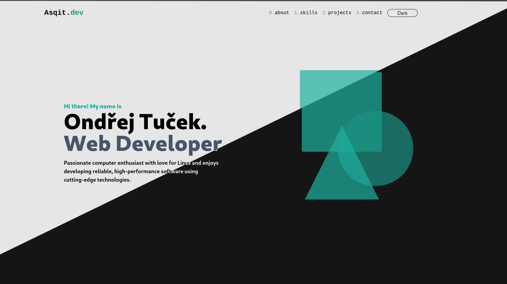
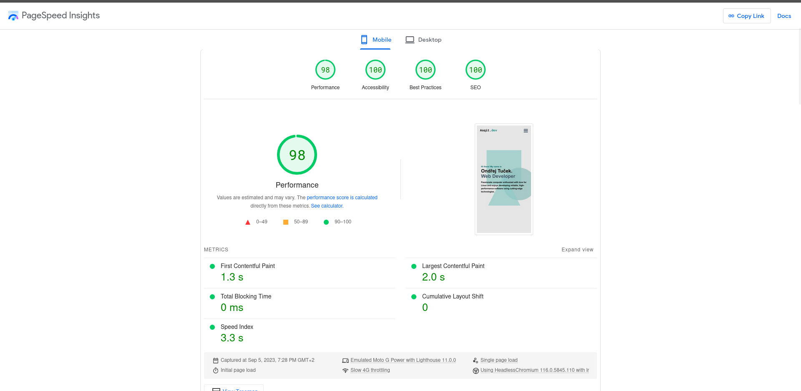

# Portfolio website



My portfolio website developed with Fresh.js, TypeScript and styled with
Tailwind CSS. Website is aiming to be fast, accessible and responsive.

<details>
  <summary>Lighthouse Rating</summary>
  
</details>

## Before Running locally

**Warning:** deno runtime is **required** in order to run the app. (learn more
[here](https://deno.com/manual@v1.34.3/getting_started/installation))

Since I switched from `twind` to regular `tailwindcss` a copy of
`tailwindcss-cli` has to be present in order transpile your classes into css
files. For Linux and macOS users I've prepared a shell script (`prepare.sh`)
that automatically prepares your development environment. Windows/others have to
download the copy on their own.

### Running locally

Clone the repo

```shell
git clone https://github.com/Asqit/website.git
```

Go to the repo directory

```shell
cd website
```

Start the dev. server

```shell
deno task start
```

The last command will automatically install dependecies and starts the
development server, that watches the project directory and restart as necessary.
(Also transpilles tailwind `className` --> `.css`)
